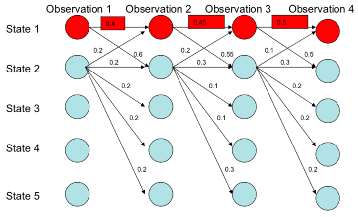
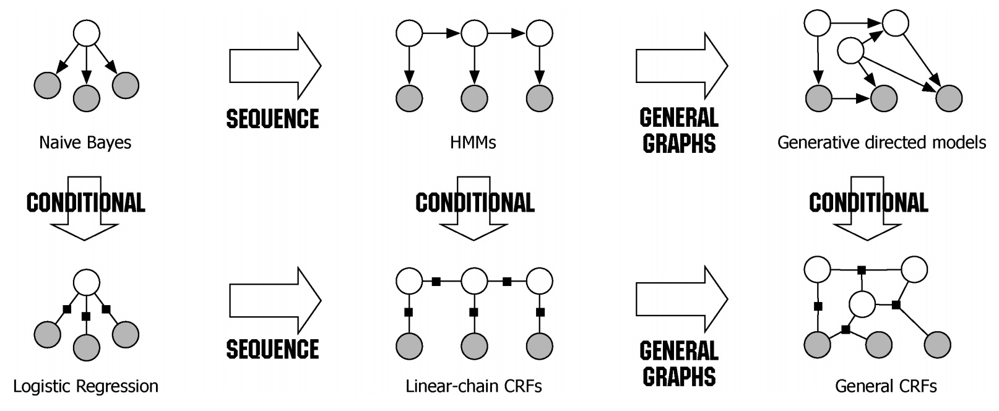

# Named Entity Recognition

### What is NER ?
> + NLP method that extract information from text
> + Identified, categorizes and extracts the most important pieces from text
> + Useful for quickly extracting key information from large amount of data
***
### NER categories
> + Supervised machine learning-based
>   + Trained on texts that have pre-labeled
> + Rules based
>   + Use rules to extract information
> + Dictionary based
***
### Data pre-processing
> 1. Sentence splitting
> 2. Tokenization
> 3. Token-classification
> 4. Lemmatization & Stemming
> 5. POS-tagging
***
### How to handle data ?
+ What kind of data can be a training data ?
  + Any text data that has been pre-processed
  + Articles, comments etc.,

+ How to store data ?
  + NoSQL databases
  + .csv, .xlsx, .xls file or even .txt file
***
### Common Algorithms
+ Maximum Entropy Markov Model

+ Conditional Random Fields

***